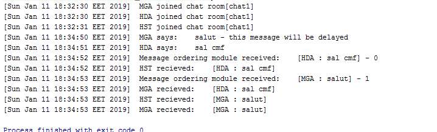
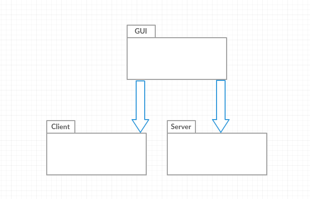
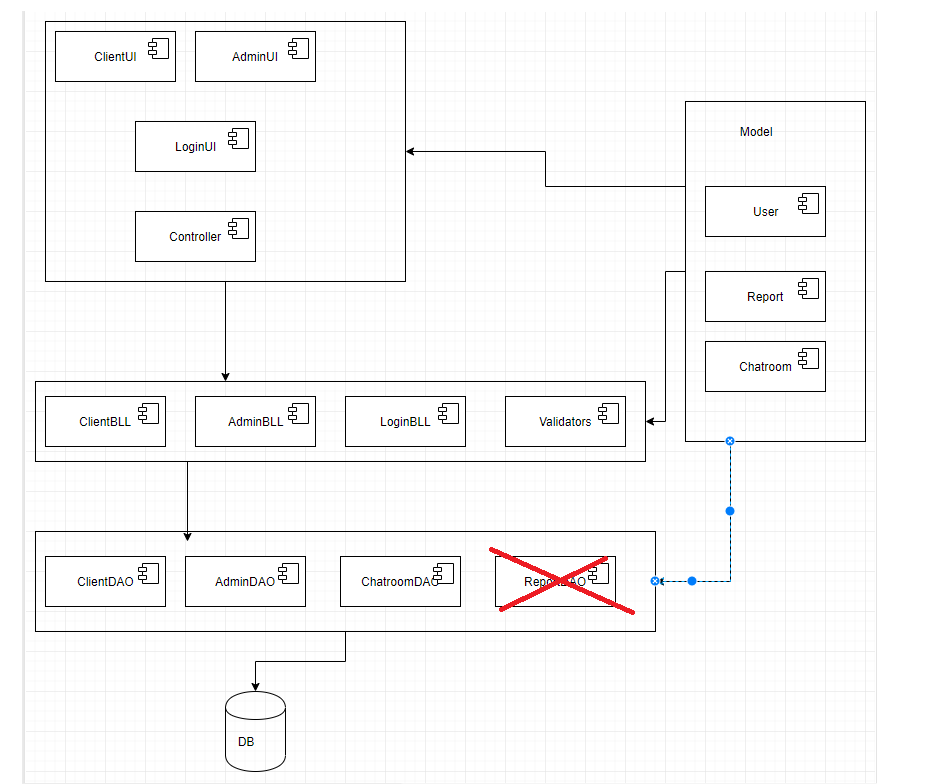
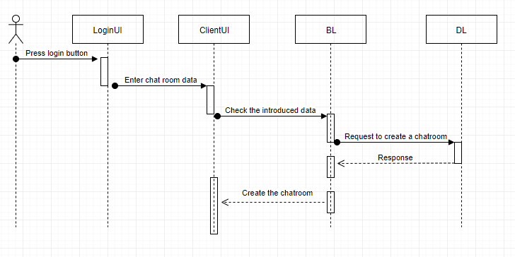
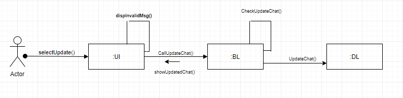
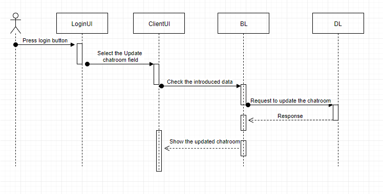
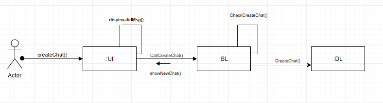
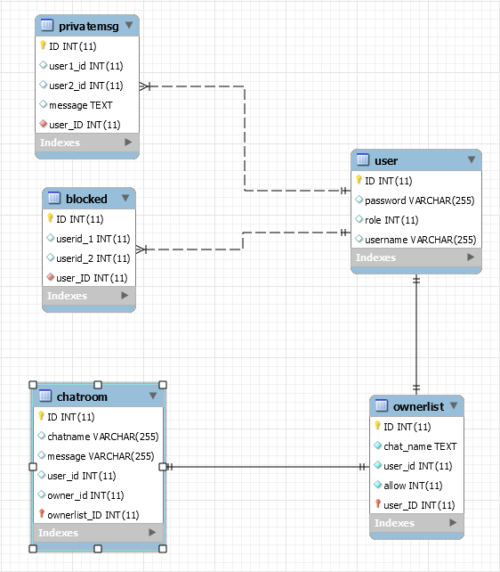
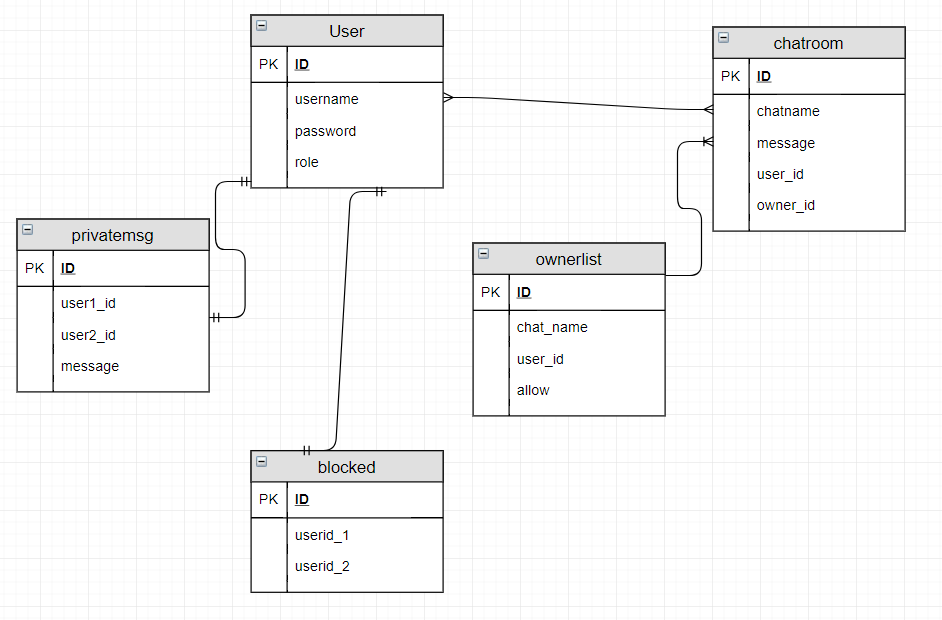

### CALCUL PARALEL SI DISTRIBUIT - NoExam Project  
### Profesor indrumator: Cosmina Ivan  
### Team: Matasariu Gabriel, Dan Harangus, Hantig Cristian Stefan  

# Chat Room Application Specification
The CRA will provide a simple inferface where the users can register. After that, they will be able to chat with other users or create chat rooms. Also, all the messages and files will be encrypted, for a secured user ecperience.All the users will be able to report other users for specific reasons and all the reports will be sent to the admin. The master user (admin) will be able to see all the conversations reports, track the active users, kick specific users based by the recieved reports and send master messages to all the users. The applicattion will notify each users when a new user logs in and will provide a list of connected users.

## Domain Model
Domain Modeling is a way to describe and model real world entities and the relationships between them, which collectively describe the problem domain space. Derived from an understanding of system-level requirements, identifying domain entities and their relationships provides an effective basis for understanding and helps practitioners design systems for maintainability, testability, and incremental development.

This application will have to implement two different entities: clients and a server. Each client will need to send a request to the server in order to connect or to send messages. The server will act in consecuquence, sending back a response to the client.

We will implement a Layered Client-Server architecture.

The conceptual classes are:
 * ClientUI, AdminUI, LoginUI, Controller- UI related classes
 * ClientBLL,AdminBLL, LoginBLL - classes containing the business logic of the app
 * ClientDAO, AdminDAO, ChatroomDAO - classes that will obtain the data form the db
 * User, Report, Chatroom - models of the db
 * Validators

## Architectural Design

### Conceptual Architecture
The client/server architectural style describes distributed systems that involve a separate client and server system, and a connecting network. The simplest form of client/server system involves a server application that is accessed directly by multiple clients, referred to as a 2-Tier architectural style.

We choose this architectural style because a chat application is nothing but the best exemple of client/server architecture. Because we want to make chat rooms, we decided to use a variation of the client/server style, called Peer-to-Peer(P2P). The P2P style allows the client and server to swap their roles in order to distribute and synchronize files and information across multiple clients. It extends the client/server style through multiple responses to requests, shared data, resource discovery, and resilience to removal of peers.

The main benefits of applying this style on my application are:
  * Higher security: All data is stored on the server, which generally offers a greater control of security than client machines.
  * Centralized data access: Because data is stored only on the server, access and updates to the data are far easier to administer than in other architectural styles.
  * Ease of maintenance and update: Roles and responsibilities of a computing system are distributed among several servers that are known to each other through a network. This ensures that a client remains unaware and unaffected by a server repair, upgrade, or relocation.

Logical structure:  
*	**Group management module** - this 'logical module' is implementing all the operation needed to successfully process messages inside a group( keep trak of members for example) - on the server  
*	**Communication module** - we implemented the basic communication mechanism because we implemented the ordering module which handles all the messages and assure the corect flow of our program  
*	**Message ordering module** - in order to assure the correct ordering of the message we process we implemented   2 ordering mechanism:    
	*	no ordering - the DB will handle the correct order of the messages sent/received  
	*	FIFO ordering - messages are processed in the order they are sent    
  
Simple experiment(FIFO mechanism):

### Package Design
Each packadge will be subdivided following the Layered architecture.

### Component and Deployment Diagrams

## Design Model

### Dynamic Behavior
Scenario 1: Client opening a new chatroom

Scenario 2: Admin updating a chatroom

### Class Design
This is just a conceptual and approximate class design. For viewing purposes, we didn't included the interfaces for the classes. In the real implementation, all the classes will provide an interface which will be sent to the next layer in order to satisfy the dependency injection principle.

####Report class information:
*	this class was intended to make a report summarying all the activity of a certain user (private messages, blocked users, chatroom messages) - it should work similar to how facebook offers you a service from which you can extract all the information facebook has about you
*	we didn't manage to fully implement this module ...

### Data Model

**Explanations:**
*	**User** - information about our users  
*	**Private message**- contains information about a private message exchanged between two users  
*	**Blocked** - information about blocked users  
*	**Chatroom** - information about a certain chat room(it's users, exchanged messages etc.)  
*	**Ownerlist** - information about the owner of a certain chatroom  

**Database replication** - we did not implement a fully automated method for our data  replication mechanism but since the server can be found on each machine runnig our Multichat Application, the process of replicating the database consist in a simple operation of copy-paste ( that's because we used SQLite for our database implementation)  
## Architectural Design Refinement

### Conceptual Arhitecture

Adding to the conceptual architecture presented in above, we would like to add the following:  
 * The application use Hibernate ORM to access the database;  
 * All the aplication is structured using Layered pattern, splitted according to the client/server architectural style.  
 
### Package Design 

### Component and deployment diagram

### Data Model

# Bibliography
- [Architectural Styles](https://docs.microsoft.com/en-us/azure/architecture/guide/architecture-styles/)
- [Architectural Patterns and Styles](https://msdn.microsoft.com/en-us/library/ee658117.aspx)
- [Online diagram drawing software](https://yuml.me/) ([Samples](https://yuml.me/diagram/scruffy/class/samples))
- [Yet another online diagram drawing software](https://www.draw.io)
- [Domain modelling] (https://www.scaledagileframework.com/domain-modeling/)
