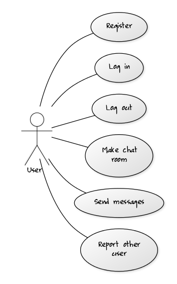
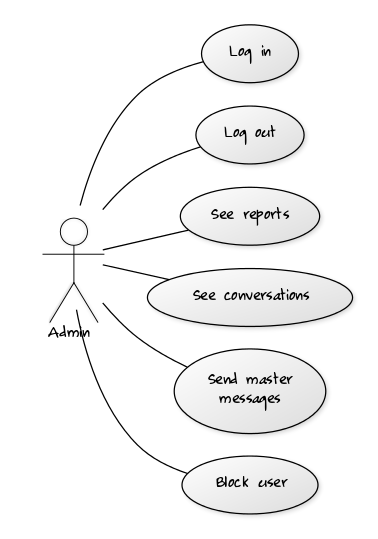

### PROIECT CALCUL PARALEL SI DISTRIBUIT - NoExam Project - Group Communication  
### **Profesor indrumator:** Cosmina Ivan
#### Echipa: Matasariu Gabriel, Harangus Dan, Hantig Cristian-Stefan

# Chat Room Application Use Case Model

# Use-Cases Identification

## Use case 1
* **Use case**: Send message
* **Level**:user-goal level
* **Primary actor**: Online user
* **Main success scenario**: 
  * the user logs in using a username and a password
  * the user chooses a user or a group of users to start a chat room
  * the user types the message in the specified field/upload the image
  * the button "send" is pressed

* **Extensions**: 
  * problems at the log in (wrong username and password combination)
  * wrong format of image

## Use case 2
* **Use case**: Block user
* **Level**: user-goal level
* **Primary actor**: Admin
* **Main success scenario**:
  * the admin logs in using a username and a password
  * the admin saw the report sent by user
  * the admin check the conversation reports
  * the admin delete de user from database
* **Extensions**: 
  * problems at the log in (wrong username and password combination)
  * trying to delete a user that doesn't exist
  * error accessing the database

## Use case 3
* **Use case**: Register
* **Level**: sub-function
* **Primary actor**: Online User
* **Main success scenario**: 
  * the user creates a new account after filling a form
* **Extensions**: 
  * using an existing username
  * wrong pasword format
  * error accesssing the database

# UML Use-Case Diagrams

## Diagram 1

## Diagram 2

# Bibliography

* [Online diagram drawing software](https://yuml.me/) ([Samples](https://yuml.me/diagram/nofunky/usecase/samples))
* [Yet another online diagram drawing software](https://www.draw.io)
